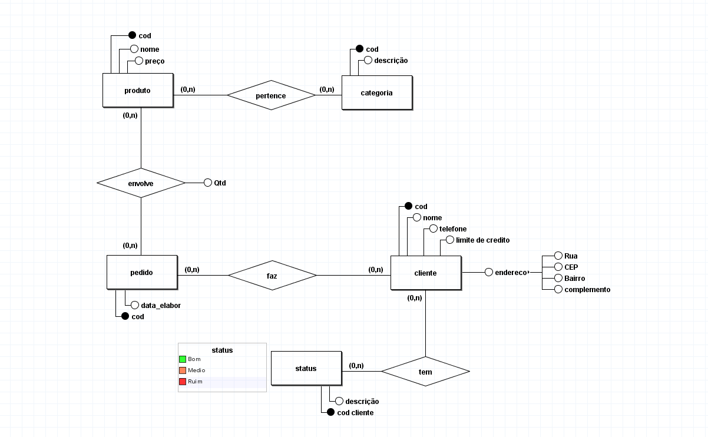
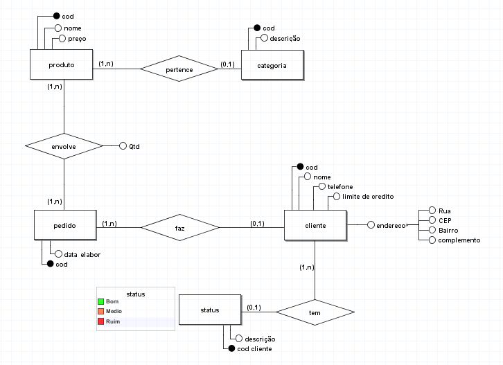
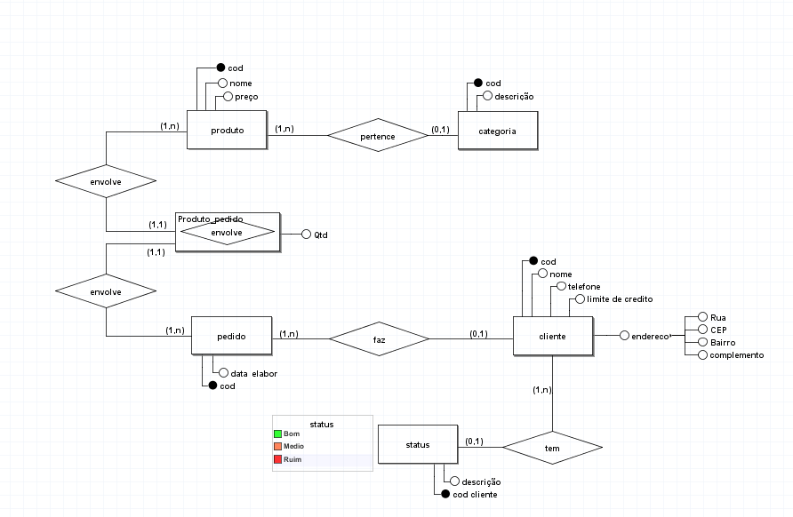

# Modelagem de sistemas de produtos

## Regra de negocio / Requesitos

Uma firma vende produtos de limpeza, e deseja melhor controlar os
produtos que vende, seus clientes e os pedidos. Cada produto é
caracterizado por um código, nome do produto, categoria (ex:
detergente, sabão em pó, sabonete, etc), e seu preço. A categoria é uma
classificação criada pela própria firma. A firma possui informações sobre
todos seus clientes. Cada cliente é identificado por um código, nome,
endereço, telefone, status ("bom", "médio", "ruim"), e o seu limite de
crédito. Guarda-se igualmente a informação dos pedidos feitos pelos
clientes. Cada pedido possui um número e guarda-se a data de
elaboração do pedido. Cada pedido pode envolver de um a vários
produtos, e para cada produto, indica-se a quantidade deste pedida.

## Modelo conceitual (DER 1.0)

## Modelo conceitual (DER 1.1)

incluindo cardinalidades pertinentes a regra de negocio, atender os requisitos do sistema com o objetivo de atender o mundo real.

## Modelo conceitual (DER 1.2)

incluindo entidades associativas pertinentes a suas cardinalidades com o objetivo de atender os requisitos do sistema.

[voltar](../../README.md)