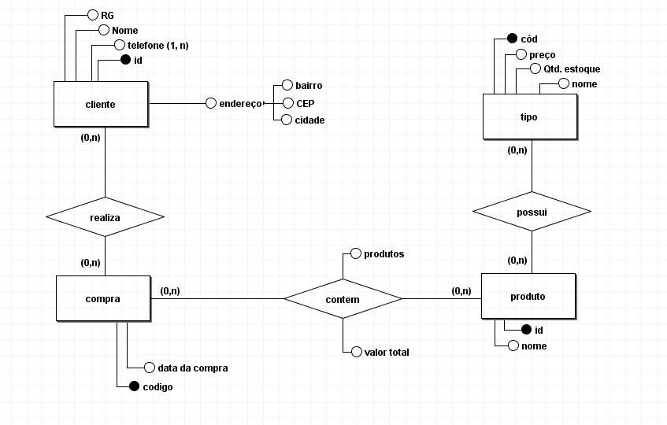
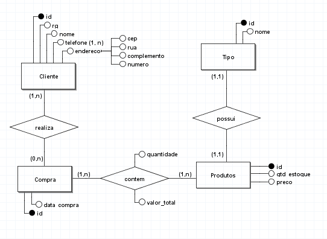
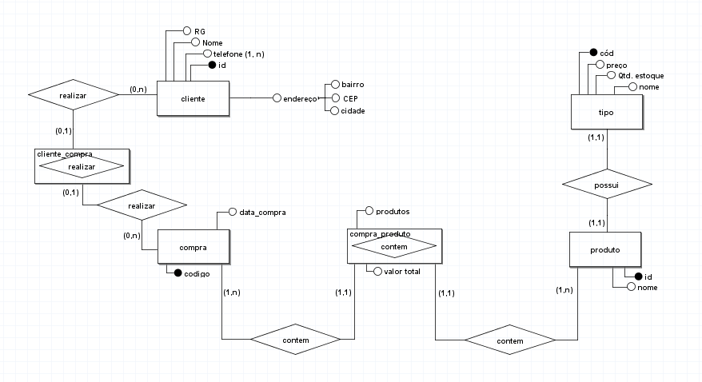

# Modelagem de sistema de uma floricultura 

## Regra de negocio / Requesitos

Uma floricultura deseja informatizar suas operações. Inicialmente,
deseja manter um cadastro de todos os seus clientes, mantendo
informações como: RG, nome, telefone e endereço. Deseja também
manter um cadastro contendo informações sobre os produtos que
vende, tais como: nome do produto, tipo (flor, vaso, planta,...), preço e
quantidade em estoque. Quando um cliente faz uma compra, a mesma é

armazenada, mantendo informação sobre o cliente que fez a compra, a
data da compra, o valor total e os produtos comprados.

## Modelo conceitual (DER 1.0)

## Modelo conceitual (DER 1.1)

incluindo cardinalidades pertinentes a regra de negocio, atender os requisitos do sistema com o objetivo de atender o mundo real.

## Modelo conceitual (DER 1.2)

incluindo entidades associativas pertinentes a suas cardinalidades com o objetivo de atender os requisitos do sistema.

[voltar](../../README.md)