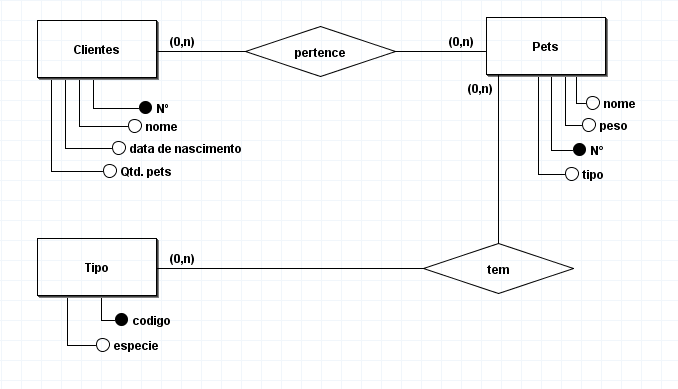
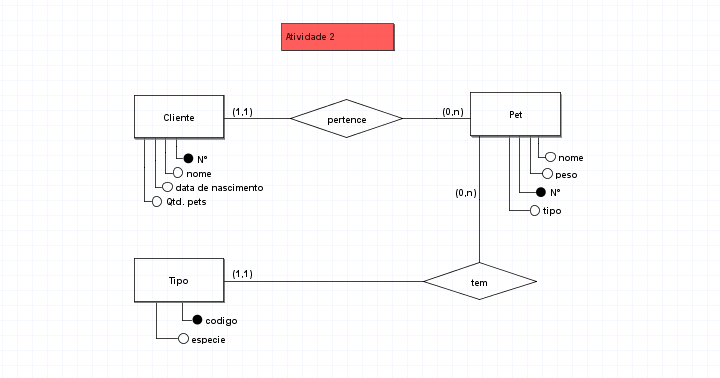

# Modelagem de sistema para um petshop

## Regra de negocio / Requesitos

Um petshop quer registrar todos os seus clientes, contendo nome,
número de identificação, data de nascimento, quantidade de pet’s,
também é importante pra loja registrar os pet’s de cada cliente, sendo
que dos pet’s deseja saber o nome, peso, código de identificação e tipo
(cachorro, gato, coelho, pássaro). Nenhum pet deve ser registrado sem
seu único dono, o mesmo vale para o seu tipo, já os clientes podem ser
cadastrados mesmo que não possuam um pet, os tipos podem ser
registrados mesmo que não possuam pets atrelados a eles.

## Modelo conceitual (DER 1.0)

## Modelo conceitual (DER 1.1)

incluindo cardinalidades pertinentes a regra de negocio, atender os requisitos do sistema com o objetivo de atender o mundo real.

[voltar](../../README.md)